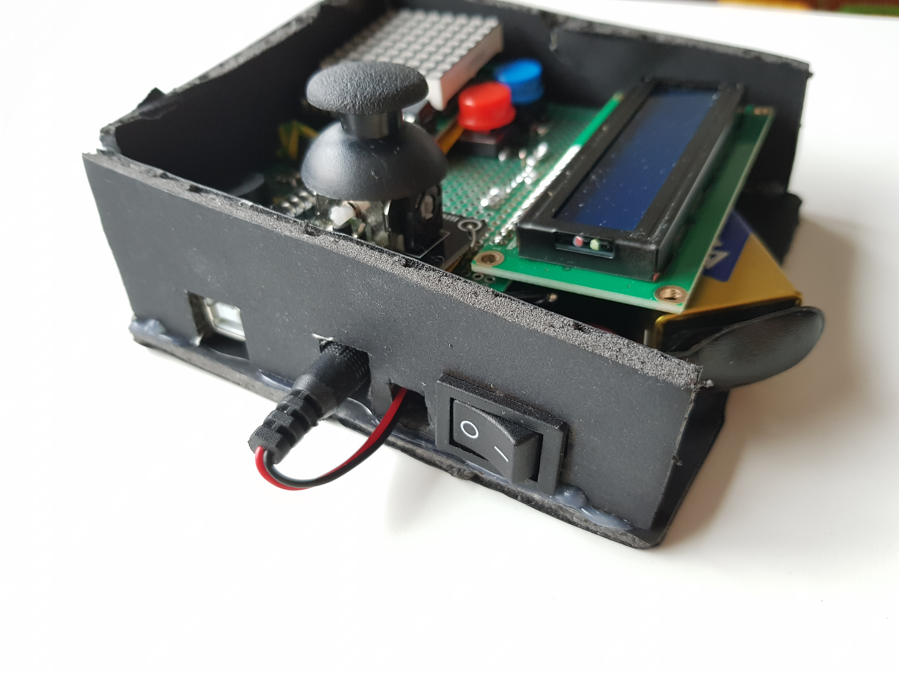
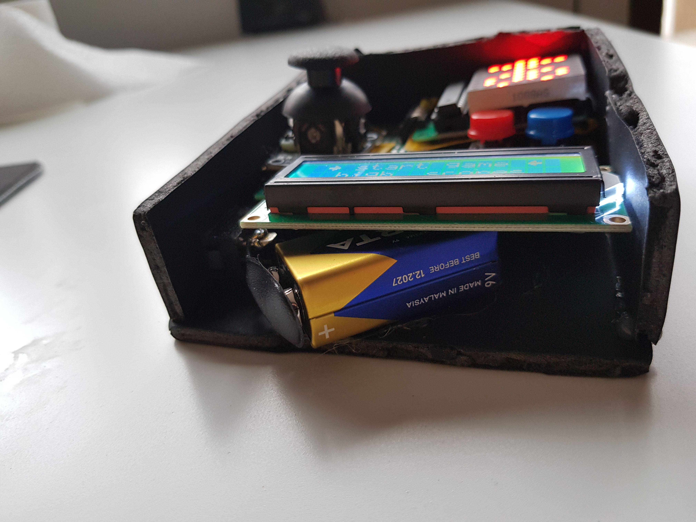

# COWBOY ROCKET

## About the projcet itself
### Overall view 
This has been a great experience. The most fun, and largest project I took part in. It was great remembering how to use
classes in C++ and thanking Christ I didn't do this in a procedural manner when I was 2000 lines of code in. I know you're not supposed to use classes and dynamic programming when writing code for microcontrollers but where's the fun
in doing everything by the book. I wanted to push the Arduino to its limits and it did actually refuse to connect to my computer via USB a couple of times (no idea what happened). 

### A couple of highlights
I'm especially happy about using inheritence and a virtual class for the matrix entities and also really enjoyed writing
by hand a double linked list in which to store and update the dynamically allocated bullets. Again, not necessary but 
a great experience.

### What about the hardware??
When it comes to hardware, at the time of writing, I managed to cram everythin on a single breadboard but a fully soldered version of the project is yet to come this week (I've got a package of electronics waiting for me at an easybox)

## The history
There have been four main stages to this project, dictated both by the requirements and by the 
time on my hands. It all started with a simple matrix game where you could only destroy walls and 
shoot bullets. No lcd, no case, no game personality. More of a start to get used to programming the 
matrix.

By this point on I started to realise how annoying it is to have two different breadboards on a single
project, especially when they are not connected and components tend to disconnect. Therefore I dedicated some hours into cramming everythin on a single breadboard.

I also had a rudimentary menu on the LCD as a requirement for this stage in the project so I also started working on that. It was a little tedious but in the end I do believe it adds a lot to the 
project ( the menu and LCD that is )

Then, the final deadline came up and all the work up to this point was all about the software.
Enemies, a better, more complete menu, an actual game with a purpose, a scoring system, everything
mentioned below.

But this was not enough. I wanted a finished project. An actual console, something standalone and somewhat complete. The breadboard mess thethered to the computer would not do. As a result I went ahead and bought some components and started soldering. This took a LONG time. Far longer than I could have anticipated. 6 hours in and I was barely a quarter of the way there. But at last, 15 hours later, 
my vision came true. A bit uglier and more asymetrical than I initially wanted but that's fine. I love my child for what he is not how he looks.

And so, this chapter ends, not with a bang but with a *beep*.

Also here's a youtube link with the working project befroe soldering:
https://youtu.be/3kBMjN-ncu4?si=xZXxHHO56YsO3chx 

## Motivation and inspiration
### Quick context
This game was the main project for my Introduction To Robotics course I took at uni. The task is listed below but the
main requirement was to design a game for an eight by eight LED matrix that would funciton using an arduino uno alone.

### Inspiration
We had some liberty in choosing the game and I ended up going for a top down arcade shooter where you have to kill 
all the enemies and destroy their lair to advance to the next level, where even more enemies and thicker walls emerge.
I created this game out of nostalgia for the top down flash shooters I used to play at my friends' houses when I was younger. There's a game in particular that I remember really enjoying but I've no idea what it's called.

### Why the name
The name of this game actually came as a result of the shooting mechanics I wanted to implement. I wanted to be able to 
both shoot normal and exploding bullets and rockets were the perfect excuse. As for the cowboy, I'm not sure what sparked
the idea but I knew I wanted to have a mascot and what better mascot than a COWBOY. Thus, COWBOY ROCKET was born.

## Commands and how to play
### What is a menu?
There are only three ways to interact with the console: the joystick, the back button (red) and the select button (blue). They are all pretty self explanatory when using the menu. Press select to go in a submenu, back to go back to the main menu. Push up or down on the joystick to look around and press play when you're ready to game. 

### How to play
To shoot use the select button while in game and to move around use the joystick. The last direction you moved in is the direction you will shoot. To pick up a power up walk over it. If you shoot it you lose it for the entire current level. 

### General description
As I said before, you're a cowboy looking to raise some scuffle. There are 5 levels in a playthrough, each having more and more enemies and walls. The enemies get harder (some follow you) and all you can do is try to survive. The goal is to destroy all of the walls and enemies without dying and as fast as you can. There is a time penalty and using the rocket bullets bonus also brings extra points. Don't forget to set the game's difficulty to COWBOY if you're going for a highscore. 

## Components
* Arduino Uno
* LCD display
* 8x8 Red LED matrix
* MAX7219 matrix driver integrated circuit
* 2 buttons
* 1 joystick
* resistors and capacitors as needed
* 1 buzzer
* plenty of wires
* 1 breadboard

## Fun facts
* there are over 4700 lines of code in this project
* over 126 000 characters
* it takes the arduino 18 to 19 milliseconds to go through the whole loop while in game
* only takes one or less while in the main menu
* you can get a negative score (just don't do anything for a while then start playing)
* you can shoot at a wall while near it without taking damage with rocket bullets if you move away fast enough 
* there is both hardware and software support for auto brightness but it annoys me too much so I soft blocked it
* there is only one pin left unused on the arduino Uno, other than pin 0 and 1 (I need my serial comms)
* there are 241 defines in this code
* soldering is hard. It took a wapping 15 hours to get it done (I *need* to learn PCB design)

## Task
Finally, the project's task. I saved the best for last. Although there's a separate file with this in the project's directory (task.pdf), I'm also going to write about it here.

Create a menu for your game, emphasis on ‘the game. You should scroll on the LCD with the joystick. Remember, you have quite a lot of flexibility here, but do not confuse that with a free ticket to slack
off. The menu should include the following functionality:
1. Intro Message - When powering up a game, a greeting message
    should be shown for a few moments.
2. Should contain roughly the following categories:
    * Start game, starts the initial level of your game
    * Highscore:
        * Initially, we have 0.
        * Update it when the game is done. Highest possible score should be achieved by starting at    
            a  higher level.
        * Save the top 3+ values in EEPROM with name and score.
    * Settings:
        * Enter name. The name should be shown in highscore. Maybe somewhere else, as well? You decide.
        * LCD brightness control (mandatory, must change LED wire that’s directly connected to 5v).
            Save it to eeprom.
        * Matrix brightness control (see function setIntesnity from the ledControl library). Make sure 
            to display something on the matrix when selecting it. Save it to eeprom.
        * Sounds on or off. Save it to eeprom.
        * Extra stuff can include items specific to the game mechanics, or other settings such as
            chosen theme song etc. Again, save it to eeprom. You can even split the settings in 2: game
            settings and system settings.
    * About: should include details about the creator(s) of the game. At least game name, author and
        github link or user (use scrolling text?)

    * How to play: short and informative description

3. While playing the game: display all relevant info
    * Lives
    * Level
    * Score
    * Time?
    * Player name?
    * etc
    
4. Upon game ending:
    * Screen 1: a message such as ”Congratulations on reaching level/score X”. ”You did better than y
        people.” etc. Switches to screen 2 upon interaction (button press) or after a few moments.
    * Screen 2: display relevant game info: score, time, lives left etc. Must inform player if he  
        she beat the highscore. This menu should only be closed by the player, pressing a button.

### Game requirements:
* Minimal components: an LCD, a joystick, a buzzer and the led matrix.
* You must add basic sounds to the game (when ”eating” food, when dying, when finishing the level 
    etc). Extra: add theme songs.
* Each level / instance should work on 16x16 matrix. You can apply the concept of visibility / fog of 
    war (aka you only see 8x8 of the total 16x16 matrix, and you discover more as you move around) or
    you can use the concept of ”rooms”. Basically you will have 4 rooms that you need to go through on 
    each level.
* It must be intuitive and fun to play.
* It must make sense in the current setup.
* You should have a feeling of progression in difficulty. Depending on the dynamic of the game, this 
    is done in the same level or with multiple levels. You can make them progress dynamically or have
    a number of fixed levels with an endgame. Try to introduce some randomness, though.

## My touch
Other than this whole game being my brain child, there's some nice touches I gave it that might
be worth mentioning.

* when taking damage the LCD blinks
* there are separate Matrix Icons for each Menu
* you can skip any message/animation by pressing back
* you can choose what difficulty to play at in order to get more lives or more points
* it felt like I did much more extra but it looks like that's it

If you're still here, thanks for reading all this!
